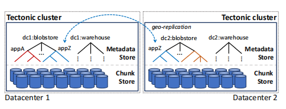
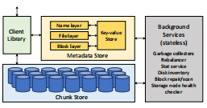

# Tectonic : Facebook新一代分布式文件系统

## Background推荐补充

《Finding a Needle in Haystack: Facebook’s Photo Storage.》 

《HDFS Architecture Guide》

《f4: Facebook’s Warm BLOB Storage System.》

分别讲述了Haystack, HDFS, f4三种facebook之前的存储结构

《Azure
Data Lake Store: a hyperscale distributed file service
for big data analytics.》主要讲了Facebook之前处理元数据的扩展问题
## 引出问题

在之前的存储方案中，Facebook不同种类的存储数据存储在不同种存储结构之中，这使得运营和资源十分麻烦，所以就引出了文章的主题：统一各种资源的存储。

Tectonic系统面临三个挑战：扩展存储系统的规模(eb级别)；提供租户之间的性能隔离；以及对于特定租户的优化

Haystack：高访问频率&复制实现高可用（空间效率低）

f4：吞吐量次于haystack，但空间效率高

结论：两种存储系统互相拥有对方急缺的资源

这里涉及到一个逻辑推导，在硬盘发展的过程中，容量不断扩增，但IOPS维持不变，这样就会导致单位容量的IOPS能力下降，就会使得Haystack这样需要高IOPS能力的存储系统受限。之前会使用额外的高吞吐量做额外读写盘，但空间放大会更严重。

HDFS用来做数据仓库的问题：主要是由于HDFS元数据存储在单个节点上，这个瓶颈导致单个存储系统存储性能是有上界的，但现在这个limit明显限制了数据扩张的数据仓库应用，简单来说就是存储空间不够了

## Tectonic结构

这张图相对理解的内容比较少，可以理解为Tectonic有多个数据中心，可以做到host、rack等小级别的高可用容错。数据中心的高可用容错是租户来操控。

集群由存储节点、元数据节点和用于后台操作的无状态节点组成。

在论文中的租户并不是用户，而是Tectonic整体架构的最高存储逻辑单元，有点像Ceph中的pool，为上层的应用程序提供服务

client来驱动，对上提供层次化的文件系统的API，转化为对数据和元数据的RPC

Chunk是硬件抽象出的平坦层，block层存在的意义是在这一层做纠删码的高可用，再上一层是file对接用户

### 元数据
元数据在文件系统中建立命名空间到文件、文件到数据块的关系，并进行哈希分区。Name层和其他两个层分离，这样会避免目录和其他层中的热点（这样怎么避免呢？答，其实基本上还是通过哈希天然的负载均衡优势）

为了减少读取负载，块、文件和目录都允许密封。（怎么减少读取负载？）在目录上的密封操作不会递归地影响到目录中的文件，只是组织添加对象。但是块数据在底层的动态迁移会导致缓存中有关快的元数据无效（也就是说块的元数据是无法缓存的）

（读到这里仍然无法了解密封和减少负载之间的关系，我猜想这里密封就是冻结对数据的修改操作，所以缓存已经读取的数据不会失效，所以就可以减少数据读取的难度）

元数据操作的一致性如何保证？Tectonic的一致性主要依靠键值存储的强一致操作和原子读改写事务来处理同一个目录的操作，但是ZippyDB只能处理单分片之中的事务修改操作，但是对于多分片的一致性，需要用户自己去维护。

跨目录的操作需要两阶段操作，用来检测那些半中间被挂起的移动操作

