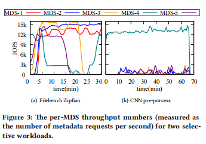
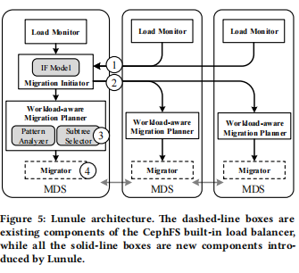

# Lunule：基于ceph元数据管理系统的加强版
## 问题发现
ceph使用的元数据动态子树管理方法有缺陷，具体体现在：

1.内置的负载平衡机制无法准确绘制集群状态的视图，从而无法及时发现不平衡的情况，并在需要时触发重新平衡。

2.主动迁移决策将抵消负载平衡的好处，并人为地引入新的不平衡情况。

3.统一的候选选择策略没有考虑各种工作负载的惟一访问模式。

这张论文中的实验结果很好的体现出了Ceph在两种特定工作负载中的缺陷，(b)图中的5个节点出现了相当大的不平衡情况，但是Ceph并未对其进行负载均衡工作；在(a)图工作负载中，30分钟的负载也不甚理想，20-30分钟的时间段内，3和4的负载对换了，预期应是平分。

## 贡献及解决方案

这张图主要是工作流的相关情况，基本属于计算机系统工作的工程细节，可以看论文具体细节，不做赘述。

协方差同样有概率论中的不确定性问题，论文作者使用Cov系数来体现各个节点元数据负载均衡的离散性质（也可以说是差异性），使用该系数来充当元数据负载工作的评价标准

原文中将U描述为urgent系数，该系数是用来体现系统中是否需要迁移的另一方面，即负载均衡是否非常大，以至于必须进行元数据迁移工作来进行负载均衡。（假如所有的节点上的元数据负载都比较小，虽然差异性可能比较大，但负载太小的话，论文作者意思是就不用费劲折腾了，没那个必要）

这个算法主要在不断更新一个矩阵，其中矩阵的元素Eij代表从节点i到节点j单向的元数据负载输出。算法12行之前的部分主要是判断一个节点是应当做输出节点还是输入节点，值得一提的是，输入节点的判断使用的是预测的负载和当前平均负载做判断。这个预测的负载是使用线性回归完成的预测。

选择子树方面，文章用了一个衡量标准来同时兼顾子树的时间局部性和空间局部性，排序过后选择最合适的来进行元数据迁移。（这个部分还有一点小细节不太懂，懂了回来更新）

