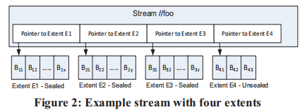

# Windows Azure Storage:一个统一的云存储？

## 补充知识
### 什么是Blob

Blob是指巨大的二进制文件，可以是视频音频等等

### 什么是DNS

DNS属于计算机网络中的基础知识，是IP地址进行域名解析时所需要用到的解析器

## WAS主要想解决怎样的问题/或是解决了业界什么样的挑战

它是微软Azure云计算的基础设施，应该算得上是微软云计算的开山之作，主要的挑战应该主要放在云计算框架是如何实现的，了解云计算实现的意义和架构。

重点：WAS所实现的存储系统，可以让用户在“任何地点和时间都可以访问他们的数据，即云存储

## 全局命名空间及WAS整体架构

意义：实现全局命名空间其实就是符合云存储的意义：即让云存储客户随时随地可以访问到云存储中的数据。这里使用了DNS，我的理解是WAS使用了DNS类似的技术去解决云存储中的寻址。

WAS在云存储中使用的命名空间分为三部分，账户名、分区名、对象名，我想这个命名空间应该是逻辑上的，在使用的时候需要通过DNS转换成物理上的网络地址（注：这里的“物理”并不是指严格意义上的物理地址（比如mac），而是指系统当中使用并且对用户透明的地址）

对于Blob文件来说，一个文件就是一个分区；对于table来说，一个行就是分区中的一个对象；每个队列是一个分区，队列中的消息是一个对象。

## 分层讨论WAS架构

### Stream Layer

stream/extent/block三层结构，在写入的时候只允许追加操作，block是读写的最小单位，并且会对block做checksum。extent是专门做stream layer的数据复制和负载均衡，stream里存储的是关于extent的指针,下图是stream layer在逻辑水平上的层次结构。

Stream Manager 在Stream层中主要是对数据结构stream和extent进行管理，extent是最基本的管理单位，负责extent的副本共识算法等等，SM对底层的block并没有管理的想法，文中提到SM并不在用户端请求的主要路径上，我看论文中图的意思，应当是说当client发起请求时，直接找到对应的EN节点，不经过SM，也就是说extent相关的元数据并不存储在SM节点里，或者说不只是存储在SM里，在Partition layer中或许有extent元数据的存储（只是读到这里的猜想，接着往下看，不一定对）（更新，SM分配的extent信息自己肯定要存，client需要先向SM获取信息后缓存）

extent node不负责对上层的stream管理，它着重处理的是extent和具体的block之间的映射关系

#### 关于强一致性

在WAS中是如何维持强一致性的呢？还要说到复制更新要求所有副本都更新，并且还有sealed机制保证。这等于是牺牲了效率而强调一致性。

### Partition Layer
Partition layer 解决的更多的是语义层的问题，将对上层提供的三种存储实现到stream layer中的stream数据结构之中。

这一层提供了一个叫做对象表的内部数据结构，并且可以分解为RangePartition，用来存储对象到extent的映射，本质上是一种元数据

range partition是不做复制副本的，它的位置信息都存储在partition map table之中，持久化仍是在stream layer中做，log比更新提前写。

像这种成名的工业界产品不需要做实验，给你们写点说明书就当赏赐你们了hh
